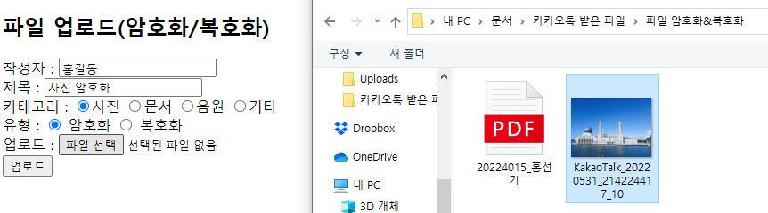

# AES_EncryptAndDecrypt
AES 방식을 사용한 파일 암호화, 복호화

# Use Environment
- IDE : Eclipse 2020-06
- DB : H2 DataBase
- Java
- JSP
- Server : Tomcat v9.0

# SQL
- <a href="https://drive.google.com/drive/folders/1nrMpS0Yarses0gh2df0-FwA3GNkDqVoY?usp=sharing">DB</a>

# Image

# 이미지
<table>
  <tr>
    <td>
      <h3>메인화면1</h3>
     </td>
    <td>
      <h3>메인화면2</h3>
     </td>
  </tr>
</table>

